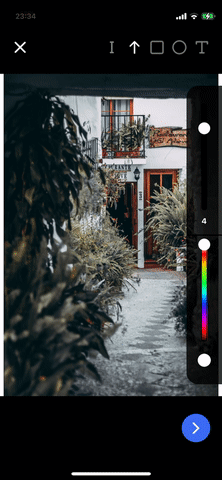

# react-native-svg-draw

React Native drawing component based on SVG with editable annotations



## Features

- Draw arrow, rectangle, ellipse ... on picture or blank view
- Compatible with `Expo`
- Built with `react-native-reanimated` v2
- Save result with `react-native-view-shot`
- Customisable

## Installation

### Bare react native app

```sh

npm install @archireport/react-native-svg-draw react-native-reanimated react-native-gesture-handler react-native-svg react-native-view-shot react-native-linear-gradient

```

### Expo

```sh

expo install @archireport/react-native-svg-draw react-native-reanimated react-native-gesture-handler react-native-svg react-native-view-shot expo-linear-gradient

```


---
**⚠️ extra steps are required**

_React Native Gesture Handler_ needs extra steps to finalize its installation, please follow their [installation instructions](https://docs.swmansion.com/react-native-gesture-handler/docs/#installation).

_React Native Reanimated_ needs extra steps to finalize its installation, please follow their [installation instructions](https://docs.swmansion.com/react-native-reanimated/docs/installation/).


---


## Usage

### Bare react native app

```js
import { DrawWithOptions } from 'react-native-svg-draw';
import LinearGradient from 'react-native-linear-gradient';

// ...

<DrawWithOptions linearGradient={LinearGradient} />;
```

### Expo

```js
import { DrawWithOptions } from 'react-native-svg-draw';
import { LinearGradient } from 'expo-linear-gradient';

// ...

<DrawWithOptions linearGradient={LinearGradient} />;
```

## Components

### DrawWithOptions

Component with header and footer, based on DrawCore

#### Properties

| Name             | Type            | Description                                                                              |
| ---------------- | --------------- | ---------------------------------------------------------------------------------------- |
| `close`          | function        | (optional) called when cross is pressed                                                  |
| `takeSnapshot`   | function        | called when send button (at the bottom) is pressed                                       |
| `linearGradient` | React Component | implementation used for linear gradient (differs between expo and bare react native app) |
| `image`          | image           | (optional) background picture                                                            |

### DrawCore

Component which can be used to customize header and footer

#### Properties

| Name                | Type            | Description                                                                              |
| ------------------- | --------------- | ---------------------------------------------------------------------------------------- |
| `drawingMode`       | enum            | used shape for drawing                                                                   |
| `onSelectionChange` | function        | called when a shape is selected                                                          |
| `linearGradient`    | React Component | implementation used for linear gradient (differs between expo and bare react native app) |
| `image`             | image           | (optional) background picture                                                            |

#### Ref attributes

Using ref on `<DrawCore/>` you can access to the following attributes

| Name                 | Type     | Description                                                      |
| -------------------- | -------- | ---------------------------------------------------------------- |
| `deleteSelectedItem` | function | delete selected item                                             |
| `takeSnapshot`       | function | take a snapshot of the result (base on `react-native-view-shot`) |

## Contributing

See the [contributing guide](CONTRIBUTING.md) to learn how to contribute to the repository and the development workflow.

## License

MIT
